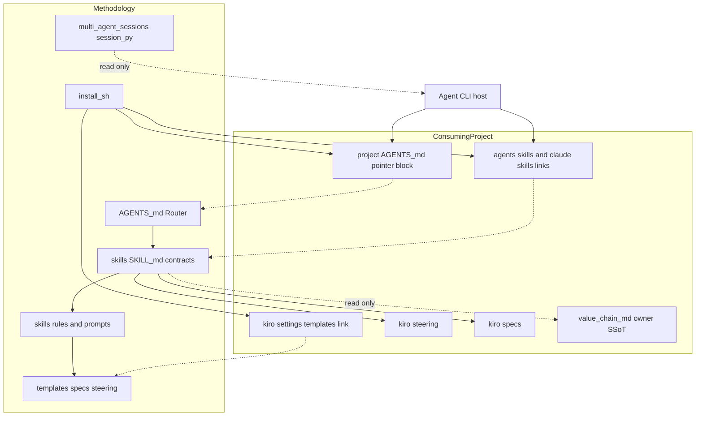
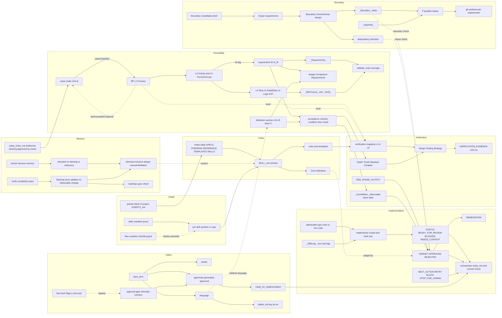
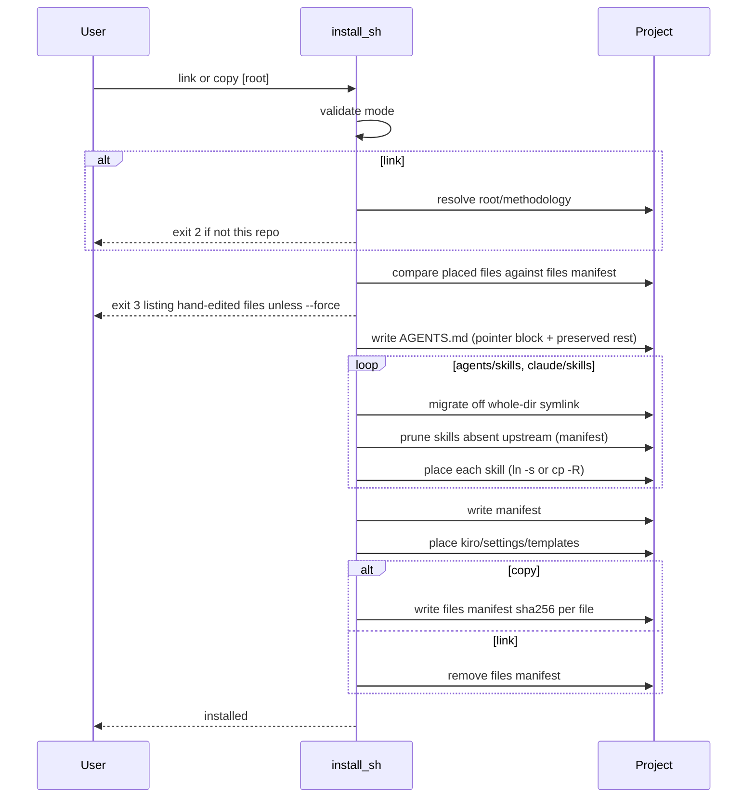
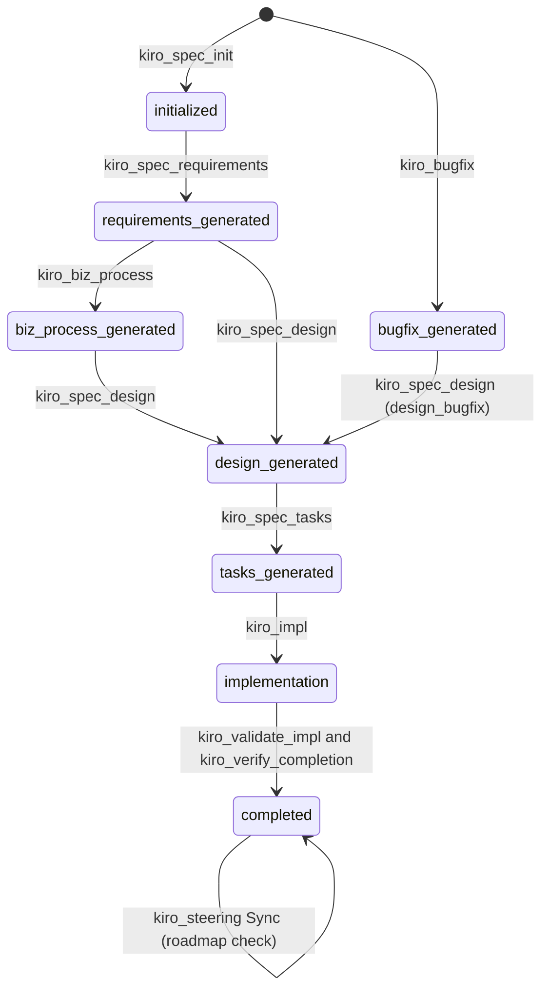
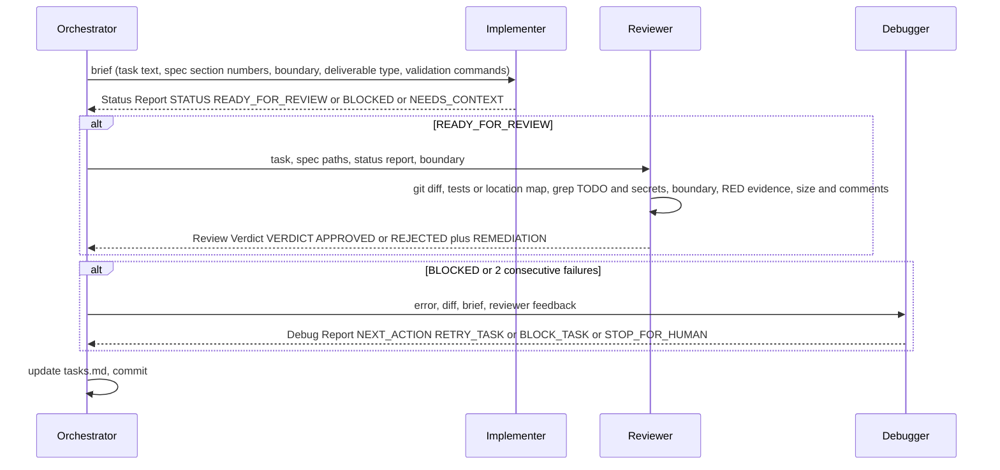

# 설계서 — agentic-psdd

> 리버스 엔지니어링 산출물. 저장소 현재 상태(커밋 `23c0a90`, 2026-09-30)를 읽어 역추출한 설계이며, 선행 `requirements.md`가 없으므로 요구사항 ID 태그는 생략한다.

## 정의
에이전트 주도 SDLC에서 사람이 이해 기반으로 승인하는 단계별 명세(요구사항 → 비즈니스 프로세스 → 설계 → 태스크)를 거쳐 구현, 검증에 이르도록 하기 위해, 라우터(`AGENTS.md`), 스킬 계약(`skills/kiro-*`), 산출물 템플릿(`templates/`)을 소비 프로젝트의 관례 경로에 링크 또는 복사로 배치하는 방법론 패키지이다.

## 경계 확정

### 소유 범위 (이 스펙)
- **라우터**: `AGENTS.md` — 경로 이름 표(`{{SPECS}}` 등), 원칙, 산출물 규약, 워크플로, 승인 게이트 규칙, steering `inclusion` 규칙
- **스킬 계약**: `skills/<name>/SKILL.md` 21개 — Inputs / Outputs(Core Indicators) / Boundaries / Rules 4절 고정
- **스킬 방법, 프롬프트**: 각 스킬의 `rules/`(방법), `templates/`(서브에이전트 브리프), `agents/openai.yaml`(호스트 표시 메타)
- **산출물 구조**: `templates/specs/`(7), `templates/labels.md`(라벨 표, ko와 en 열), `templates/steering/`(4, value-chain 초안 포함), `templates/steering-custom/`(7)
- **설치**: `install.sh link|copy` — 소비 프로젝트 배치, 재실행 갱신, 제거된 스킬 정리
- **세션 조회 도구**: `skills/multi-agent-sessions/scripts/session.py`

### 비소유 범위
- **프로젝트 지식**: `.kiro/steering`, `.kiro/specs`, `.kiro/reference` — 소비 프로젝트 소유
- **`value-chain.md`**: product owner 소유(승인 권한), `kiro-steering`이 초안(`status: draft`) 작성, 승인 후 모든 스킬 읽기 전용
- **에이전트 런타임**: 서브에이전트 디스패치, 병렬 실행, 컨텍스트 압축, 워크트리 생성의 실제 수행 — 호스트 CLI(Claude Code, Kiro, opencode, agy 등) 소유. 이 패키지는 프롬프트와 프로토콜만 정의
- **구현 코드, 테스트 실행**: `kiro-impl` 서브에이전트가 소비 프로젝트 안에서 수행

### 허용 의존
- 외부: POSIX `sh`, `awk`, `ln`, `cp`(install.sh), Python 3 표준 라이브러리 `sqlite3`, `json`, `glob`(session.py), Mermaid(설계 다이어그램 표기), 호스트 규약 — `AGENTS.md` 루트 파일, `.agents/skills/<name>/SKILL.md` 및 `.claude/skills/<name>/SKILL.md` 발견 경로, `SKILL.md` front matter(`name`, `description`), `agents/openai.yaml`(`interface`, `policy`), Kiro IDE `.kiro/` 규약
- 내부 의존 방향: `AGENTS.md` → `skills/*/SKILL.md` → `skills/*/rules/`, `skills/*/templates/` → `templates/` (역방향 참조 없음. `templates/`는 어떤 스킬도 참조하지 않는다)
- 스킬 간 교차 참조(허용 목록, SSoT 유지 목적):
  - `kiro-bugfix/rules` → `kiro-spec-requirements/rules/acceptance-criteria-format.md`
  - `kiro-steering-custom` → `kiro-steering/rules/steering-principles.md`
  - `kiro-debug` → `kiro-impl/templates/debugger-prompt.md`
  - `kiro-biz-process/rules` → `kiro-spec-design/rules/verification-mapping.md`
  - `kiro-impl/templates/{reviewer,debugger}-prompt.md` → `kiro-review`, `kiro-debug` 프로토콜(호스트가 서브에이전트 내 스킬 호출을 지원할 때만)
  - `kiro-steering` → `templates/steering/value-chain.md`(value-chain 초안 골격)

### 재검증 조건
- 호스트 CLI가 스킬을 발견하는 경로, front matter 규약 변경
- 호스트 CLI가 루트 `AGENTS.md`를 in-place 덮어쓰기하지 않게 되어 symlink가 안전해지는 경우(포인터 블록 방식의 전제)
- `spec.json` 필드 또는 `phase` 값 집합 변경(`kiro-spec-status`가 SSoT)
- Kiro IDE `.kiro/specs`, `.kiro/steering` 규약 변경
- 스킬 추가, 삭제, 개명(매니페스트 정리 로직과 `AGENTS.md` Workflow 절 동시 갱신 필요)
- 서브에이전트 구조화 출력(`- STATUS:`, `- VERDICT:`, `- NEXT_ACTION:`) 파싱 형식 변경

## 아키텍처

### 경계 맵


### 키워드 맵
방법론 전반에 걸쳐 쓰이는 키워드와 그 연결. 실선 = 파생, 참조(값 복제 없음), 점선 = 소비, 판정.

- Boundary 계열 용어는 단계마다 이름이 바뀌지만 하나의 개념이 흐른다: Candidates(brief) → Scope(requirements) → Commitments(design) → `_Boundary:`(tasks) → 리뷰어 경계 검사.
- 요구사항 ID `N.M`은 값이 아니라 참조 키다: biz-process 태그, design Component, tasks `_Requirements:`, 리뷰어 `REQUIREMENTS_CHECKED`가 모두 같은 번호를 쓰며 `REQ-*` 별칭 생성은 금지.
- V-모델은 좌측(biz-process L1~L6)과 우측(verification mapping → Testing Strategy → VERIFICATION_EVIDENCE)이 레벨 번호로만 이어진다. biz-process.md에는 검증이 기록되지 않는다.
- `(P)`는 `_Boundary:` 비중첩과 `_Depends:` 충족이 모두 확인될 때만 붙고, 실행 시 워크트리 격리로 실현된다.
- Core Indicators는 산출물이 아니라 판정 기준이다: 스킬 계약이 선언하고, 리뷰어, 검증 스킬이 증거로 확인한다.

### 기술 스택
| 계층 | 선택 기술 | 역할 |
|-------|--------|------|
| 라우터 | Markdown (`AGENTS.md`) | 경로 이름 해석, 원칙, 워크플로 진입점 |
| 스킬 계약 | Markdown + YAML front matter (`SKILL.md`) | 호스트가 발견, 나열하는 단위, 4절 고정 계약 |
| 호스트 메타 | YAML (`agents/openai.yaml`) | 표시명, 암묵 호출 금지(`allow_implicit_invocation: false`) |
| 방법 규칙 | Markdown (`rules/*.md`) | 스킬이 필요한 단계에서만 경로로 로드 |
| 서브에이전트 브리프 | Markdown (`templates/*-prompt.md`) | 구현, 리뷰, 디버그 프로토콜과 구조화 출력 스키마 |
| 산출물 구조 | Markdown + JSON (`templates/specs`, `templates/steering*`) | 스펙, steering 문서 골격 |
| 설치 | POSIX sh | 상대 symlink 또는 복사, 포인터 블록, 매니페스트 |
| 세션 조회 | Python 3 표준 라이브러리 | 4종 에이전트의 세션 저장소 읽기 전용 파싱 |

### 핵심 결정
- **`AGENTS.md`는 symlink가 아닌 포인터 블록**: `<!-- methodology:begin/end -->` 사이만 관리, 나머지 보존 — 이유: 루트 `AGENTS.md`를 in-place 덮어쓰는 호스트가 symlink를 통해 원본 `methodology/AGENTS.md`를 손상시킴.
- **포인터는 조건부**: 스펙 작업(`$kiro-*`, `.kiro/specs`, `.kiro/steering`)일 때만 `methodology/AGENTS.md`를 읽음 — 이유: 운영 세션이 많은 프로젝트에서 라우터(약 7KB)가 매 세션 로딩되지 않게 함(MoE, 지연 로딩).
- **스킬 개별 symlink, 템플릿 디렉터리 통째 symlink**: — 이유: 소비 프로젝트가 같은 디렉터리에 둔 자체 스킬을 가리지 않음; 템플릿은 방법론 전유.
- **매니페스트(`.kiro/settings/.methodology-skills-manifest`)**: 배치한 스킬 이름 목록 — 이유: 상류에서 제거, 개명된 스킬을 재실행 시 정리(dangling link, stale copy 방지).
- **파일 해시 매니페스트(`.kiro/settings/.methodology-files-manifest`)**: copy 모드가 배치한 파일마다 SHA-256 기록, 이후 실행은 해시가 달라진 파일을 발견하면 exit 3으로 정지(`--force`로 무시) — 이유: 프로젝트가 손댄 복사본을 재설치가 조용히 덮어쓰지 않게 함.
- **link 모드 사전 검증**: `$ROOT/methodology`가 스크립트 자신으로 물리 해석되는지 확인 후 시작 — 이유: 상대 링크 `../../methodology/...`가 고정이라 불일치 시 dangling link 양산.
- **경로 이름 치환(`{{SPECS}}` 등)**: 스킬은 이름만 사용, `AGENTS.md` Paths 표가 유일한 해석점 — 이유: SSoT, 표 한 곳 수정으로 재배치.
- **스킬 = 계약 + rules + templates 3분리**: `SKILL.md`는 짧은 계약, 방법은 `rules/`, 브리프는 `templates/` — 이유: MoE, 필요한 단계에서만 로드하여 컨텍스트 절약.
- **Core Indicators로 평가**: 산출물에 지시를 싣지 않고 계약의 출력 지표로 판정 — 이유: 지침/히스토리 분리.
- **추론 영어, 산출물은 `spec.json.language`**: 에이전트용 파일(라우터, 스킬, 규칙, 자리표시자)은 영어, 산출물의 제목과 고정 라벨은 `templates/labels.md`에서 언어 열로 렌더, 스펙 밖 산출물은 `specs/init.json`의 언어 — 이유: 혼합 언어 팀에서 도구 동작 일관성, 사람 대면 문서만 지역화, 제목 이름의 SSoT.
- **템플릿에 고정 문구 없음**: 제목, 굵은 라벨, 표 열 머리는 라벨 키, 작성자 안내는 HTML 주석, 기계 태그와 식별자만 고정 — 이유: 언어 전환 시 누락 방지, 산출물에 지시를 싣지 않음.
- **Goal Delivery**: 구현은 스펙 `Definition`의 목표를 달성하는 산출물 전달(코드, 문서, 데이터, 설정, 분석), 검증은 유형별 증거(코드: RED → GREEN, 비코드: 미충족 목록 → 요구사항 ID별 위치) — 이유: 설계 문서가 계약 산출물인 과제도 같은 게이트로 검증.
- **가치사슬 = 초안 작성과 승인 분리**: `kiro-steering`이 `status: draft`로 초안, 책임자만 `approved`, 승인 후 읽기 전용 — 이유: 소유권은 승인 권한, 부트스트랩 마찰 제거.
- **완료 시 Steering Sync**: `kiro-verify-completion` 통과 시 `kiro-steering` Sync가 산출물과 핵심 결정을 steering에 추가 반영, roadmap 체크, 가치사슬 변경은 제안만 — 이유: 규칙만 있고 실행 단계가 없던 공백 해소, 비코드 산출물도 대상.
- **Self-Documenting, Small Units**: 주석은 WHY만, 크기 기준(함수 40, 클래스 200, 파일 300줄, 중첩 3, 매개변수 4)은 steering `tech.md` 한 곳, 리뷰어 13번 항목과 validate-impl이 확인 — 이유: 이름과 구조로 설명, 기준값 SSoT.
- **discovery 경로 A~E**: 기존 스펙, 스펙 불필요, 단일, 다중, 혼합으로 분류하고 결정 근거를 함께 기록, 경로별 파일 위치 고정 — 이유: 다음 명령과 산출물 위치를 경로가 결정(cc-sdd 계승).
- **batch 후 스펙 간 교차 검토**: 중복, 범위 겹침, 인접 기대 미충족, 순서, 용어, 정의 중복을 3라운드까지 수리, 분해 결함은 discovery로 복귀 — 이유: 스펙별 자가점검으로는 스펙 사이 모순을 못 잡음. requirements 단계에서 수행해 승인 게이트 유지.
- **태스크 실행 = 의존 wave**: wave 안의 `(P)`만 호스트 지원 시 동시(워크트리), 나머지와 미지원 호스트는 순차, 태스크 번호순 병합, wave 단위 종료 — 이유: `(P)`의 실행 의미를 한 곳(`kiro-impl`)에 정의.
- **속성 기반 테스트(코드)**: `[always]`, 입력 범위 기준, bugfix 불변 동작에서 속성 도출, 속성마다 필수 테스트 태스크, 반례 시 사용자와 결정 — 이유: 예시 테스트가 놓치는 입력 공간 검증(Kiro PBT 계승).
- **이름 규칙**: 요구사항 그룹명은 대상과 의무, 주제만 있는 이름과 모호한 연결어 금지; 가운뎃점은 어디에도 쓰지 않음 — 이유: Descriptable Name, 자가점검 기계 검사 가능.
- **V-모델 좌, 우 분리**: biz-process 스킬은 좌측 전개(L1~L6)만, 검증 레벨 매핑은 `kiro-spec-design/rules/verification-mapping.md`가 소유하고 Testing Strategy가 기록 — 이유: 검증 기준의 SSoT를 설계에 둠.
- **승인 게이트 + `-y`/`--auto` 우회**: 각 단계 사람 검토, 의도적 fast-track만 우회 — 이유: 이해 기반 동의(Informed Consent).
- **서브에이전트 출력은 파싱 가능한 고정 블록**: `## Status Report`/`## Review Verdict`/`## Debug Report`의 정확한 필드 줄 — 이유: 부모 컨트롤러가 기계적으로 분기.
- **리뷰어는 보고를 신뢰하지 않음**: `git diff`, 테스트, grep을 직접 실행, RED 단계 증거 요구 — 이유: 구현자 자기보고는 증거가 아님.
- **`_Difficulty:`로 구현자 매칭**: low → 소형 모델 + Procedure 부록 포함 브리프, mid/high → 최강 모델 — 이유: 비용, 품질 균형.
- **워크트리 격리 + 세션 로테이션**: 병렬 구현자는 별도 git worktree, 컨텍스트 50% 지점에서 새 세션 — 이유: 재생성 산출물 충돌 방지, 압축으로 인한 맥락 손실 회피.
- **세션 조회는 저장소 직접 읽기**: 에이전트 CLI를 기동하지 않고 파일, sqlite를 읽기 전용으로 — 이유: opencode CLI 출력 64KiB 절단 관찰, 실행 중 세션 간섭 방지.

## 시스템 흐름

### 설치 (`install.sh`)

- 결정: `place`는 대상 `rm -rf` 후 배치 — 재실행이 곧 갱신.
- 결정: 기존 포인터 블록은 파일 어디에 있든 `awk`로 제거 후 맨 위에 재삽입, 블록 직후 빈 줄 1개도 흡수.

### 스펙 상태 기계 (`spec.json.phase`)

- 각 전이는 `approvals.<doc>.{generated, approved}`와 `updated_at` 갱신을 동반. `ready_for_implementation`은 tasks 승인 후 true.
- 선택 검증(`kiro-validate-gap`, `kiro-validate-design`)은 상태를 바꾸지 않는다. `kiro-spec-quick`은 init→requirements→design(-y)→tasks(-y)를 한 번에 진행하고 두 선택 검증을 건너뛴 뒤 sanity review로 대체.

### 구현 루프 (`kiro-impl`)

- 결정: 구현자는 `tasks.md` 수정, 커밋 금지(부모 소유). 리뷰어는 산출물 변경 금지. 디버거는 수정 계획만.
- 결정: 부모는 요구사항, 설계의 태스크 관련 절만 전달하고 남은 컨텍스트 수치는 노출하지 않는다.

## 컴포넌트와 인터페이스

### `AGENTS.md` — Router
- 의도: 스킬이 쓰는 경로 이름을 해석하고 원칙, 워크플로, 게이트 규칙을 한 곳에 둔다.
- 절: `## Paths`(이름→기본 경로→보유물 표), `## Principles`(SSoT, SRP(Small Units), Self-Documenting(Descriptable Name, Why-Only Comment), Goal Delivery, 지침/히스토리 분리, MoE, Lean), `## Artifacts`(`Definition` 개시, 수용 기준 형식, 추적성 체인, ~200줄 상한), `## Workflow`(Phase 0~2 명령 순서), `## Skills`(`$kiro-<name>` 호출), `## Rules`(승인 게이트, 영어 추론, 평가 보고 원칙), `## Steering`(`inclusion` 규약, 승격).
- 계약 특이사항: 소비 프로젝트에서는 원본이 아니라 포인터 블록으로 도달한다. 스킬 텍스트는 이 파일의 Paths 표 없이는 경로를 해석할 수 없다.

### `install.sh` — Installer
```sh
install.sh link [project-root] [--force]   # 상대 symlink 배치, project-root/methodology == 이 저장소여야 함
install.sh copy [project-root] [--force]   # 실 파일 복사, 의존 없음
# exit 2: 잘못된 MODE, 또는 link 모드에서 methodology 경로 불일치. set -eu.
# exit 3: 이전 copy 설치본을 프로젝트가 수정한 파일 존재(목록 출력). --force 로 덮어씀.
```
- 내부 함수: `place(target, rel_link, src)`, `pointer_block`, `rest_without_pointer(file)`, `write_agents_md`, `skill_exists_in_src(name)`, `prune_removed_skills(dest)`, `place_skills(dest)`, `hash_file(path)`, `modified_placed_files`, `write_files_manifest(dirs…)`.
- 실패 모드: 기본 `ROOT`는 스크립트 위치의 부모(= `methodology/` 가정). link 검증은 프로젝트를 건드리기 전에 수행. `.agents/skills`가 디렉터리가 아니면(구 whole-dir symlink 포함) `rm -f` 후 재생성.

### `skills/<name>/SKILL.md` — Skill Contract (공통 스키마)
```yaml
---
name: kiro-<name>            # 호스트 발견 키, 디렉터리명과 일치
description: Lean contract for kiro-<name>: <one line>
---
# kiro-<name>
Inputs        # 읽는 산출물, 인자
Outputs       # Core Indicators: 대문자 스네이크 지표 목록
Boundaries    # 하지 않는 것
Rules         # 읽을 rules/template 경로, 정지 조건, 쓰는 파일, Next 명령
```
- `agents/openai.yaml`: `interface.display_name`, `interface.short_description`, `policy.allow_implicit_invocation: false`. 예외 — `kiro-spec-batch`는 `name`/`description` 평면 형식; `kiro-biz-process`, `kiro-bugfix`, `kiro-orchestrate`, `multi-agent-sessions`는 파일 없음.
- 규칙 로드는 "Read `rules/x.md` from this skill's directory" 문장으로 명시 — 경로 기반 lazy load.

### 스킬 카탈로그 (Inputs → Core Indicators → 소유 rules/templates)
| 단계 | Skill | Inputs | Core Indicators | rules / templates |
|---|---|---|---|---|
| Phase 0 | `kiro-steering` | brief.md, value-chain.md(선택), Sync 시 완료 스펙 산출물 | STEERING_STATE, STEERING_SYNC, VALUE_CHAIN_LINKS, BOUNDARY_COMMITMENTS | `rules/steering-principles.md` |
| Phase 0 | `kiro-steering-custom` | brief.md, steering_notes.md | CUSTOM_GUIDANCE, BOUNDARY_TWEAKS | (kiro-steering 규칙 공유) |
| Discovery | `kiro-discovery` | brief_seed.md, project_state.json(선택) | PATH_DETECTED(A~E), BOUNDARIES_DEFINED, SPEC_ROUTES, DECISION(GO / NEEDS_CLARIFICATION / STOP) | `rules/discovery-paths.md`, `templates/brief.md`, `templates/roadmap.md` |
| Spec | `kiro-spec-init` | brief.md, roadmap.md(선택) | SPEC_JSON | — |
| Spec | `kiro-spec-requirements` | brief.md | REQUIREMENTS_MD, ACCEPTANCE_CRITERIA, BOUNDARY_FLAGS | `rules/acceptance-criteria-format.md`, `rules/requirements-self-check.md` |
| Spec | `kiro-bugfix` | 버그 리포트, 기존 스펙 | BUGFIX_MD, UNCHANGED_BEHAVIORS | `rules/bugfix-analysis.md` |
| Spec | `kiro-biz-process` | requirements.md(승인), value-chain.md(승인), spec.json | BIZ_PROCESS_MD, VALUE_CHAIN_LINKS | `rules/biz-process-rules.md` |
| Spec | `kiro-spec-design` | requirements.md 또는 bugfix.md, brief | DESIGN_MD, DESIGN_BOUNDARIES, INTERFACES | `rules/design-discovery-{light,full}.md`, `design-synthesis.md`, `design-principles.md`, `verification-mapping.md`, `design-self-check.md`, `design-bugfix.md` |
| Spec | `kiro-spec-tasks` | requirements.md, design.md | TASKS_MD, TASK_LIST | `rules/tasks-generation.md`, `rules/tasks-parallel-analysis.md` |
| Spec | `kiro-spec-quick` | 기능 설명 [--auto], brief.md(선택) | SPEC_JSON, REQUIREMENTS_MD, DESIGN_MD, TASKS_MD, SANITY_REVIEW | (하위 스킬 위임) |
| Spec | `kiro-spec-batch` | roadmap.md, discovery brief.md | SPEC_LIST, BRIEFS, DEPENDENCY_ORDER, CROSS_SPEC_REVIEW | `rules/cross-spec-review.md` |
| Spec | `kiro-spec-status` | spec.json, milestones.md(선택) | STATUS_REPORT, PROGRESS, NEXT_GATES | — (phase 값 집합의 SSoT) |
| Validate | `kiro-validate-gap` | requirements.md, design.md | GAP_ANALYSIS, RECOMMENDATIONS | `rules/gap-analysis.md` |
| Validate | `kiro-validate-design` | design.md, requirements.md | DESIGN_VALID, BOUNDARY_COMPLIANCE, ISSUES | `rules/design-go-nogo.md` |
| Impl | `kiro-impl` | brief, requirements, design, tasks | STATUS, VERIFICATION_RESULTS, DELIVERABLE_CHANGES, TASKS_UPDATE, ERROR_FLAGS | `templates/{implementer,reviewer,debugger}-prompt.md` |
| Impl | `kiro-review` | TASK_ID, TASK_TEXT, 3문서, git_diff | VERDICT, REASONS, REMEDIATION | (reviewer-prompt가 프로토콜) |
| Impl | `kiro-debug` | brief.md, spec.json (+3문서) | ROOT_CAUSE, CATEGORY, FIX_PLAN, VERIFICATION, NEXT_ACTION, CONFIDENCE, NOTES | (debugger-prompt가 프로토콜) |
| Validate | `kiro-validate-impl` | tasks.md, 검증 결과, design, requirements | VALIDATION_RESULT, ISSUES, VERIFICATION_EVIDENCE | — |
| Validate | `kiro-verify-completion` | spec_state, final_validation_result | DONE_EVIDENCE, VERIFICATION_REPORT, STEERING_SYNC | — (통과 시 kiro-steering Sync, 교훈은 저장소 밖 하네스 메모리) |
| Orchestrate | `kiro-orchestrate` | ticket.md, brief.md | TICKET_INGESTED, FLOW_STEPS, NEXT_COMMAND | `{{STEERING}}/ticket-workflow.md`(manual) |
| Util | `multi-agent-sessions` | source, project, session, keyword | SESSION_LIST, SESSION_VIEW, SEARCH_HITS | `scripts/session.py` |

### `kiro-impl/templates/*-prompt.md` — Sub-agent Protocols
```text
## Status Report            (implementer, 부모가 `- STATUS:` 줄 파싱)
- STATUS: READY_FOR_REVIEW | BLOCKED | NEEDS_CONTEXT
- TASK, TASK_BRIEF, FILES_CHANGED, REQUIREMENTS_CHECKED, DESIGN_CHECKED
- RED_PHASE_OUTPUT, TESTS_RUN, CONCERNS, BLOCKER, BLOCKER_REMEDIATION, MISSING, EVIDENCE

## Review Verdict           (reviewer, 부모가 `- VERDICT:` 줄 파싱)
- VERDICT: APPROVED | REJECTED
- TASK, MECHANICAL_RESULTS{Tests, TBD/TODO grep, Secrets grep, Boundary, RED phase, Size/Comments}, FINDINGS, REMEDIATION(REJECTED 시 필수), SUMMARY

## Debug Report             (debugger)
- ROOT_CAUSE
- CATEGORY: MISSING_DEPENDENCY | RUNTIME_MISMATCH | MODULE_FORMAT | NATIVE_ABI | CONFIG_GAP | LOGIC_ERROR | SPEC_CONFLICT | EXTERNAL_DEPENDENCY
- FIX_PLAN, VERIFICATION, NEXT_ACTION: RETRY_TASK | BLOCK_TASK | STOP_FOR_HUMAN, CONFIDENCE: HIGH | MEDIUM | LOW, NOTES
```
- 구현자: 산출물 유형(code, document, data, config, analysis)을 받음. 코드 행동 태스크는 Feature Flag Protocol(OFF 플래그 → RED → GREEN → 플래그 제거), 비행동은 RED→GREEN→REFACTOR; 비코드는 미충족 목록(RED 상당) → 작성 → 요구사항 ID별 위치 대응. 마지막 문단이 계획, 질문, 약속이면 도구 호출로 실행 후 종료.
- 리뷰어 13항목: 기계 검사 5(테스트, TBD/TODO grep, 시크릿 grep, 경계, RED 증거) + 판단 검사 8(실물성과 자리표시자 잔존, 수용 기준, 요구사항 정합, 설계 정합과 의존 방향, 테스트 품질, 오류 처리, 렌더 출력, 크기와 주석). 코드 전용 항목은 비코드 산출물에서 N/A. 하나라도 실패 → REJECTED.

### `multi-agent-sessions/scripts/session.py` — Session Reader
```text
session.py list     [--project P] [--source claude|opencode|agy|kiro] [--limit N]
session.py show     [SESSION|latest] [--project P] [--source S] [--role all|user|assistant] [--full] [--thinking]
session.py search   KEYWORD [--project P] [--source S] [--all-projects]
session.py timeline [--project P] [--source S|all] [--limit N]
# exit 1: 세션 디렉터리/DB 없음, 세션 미발견, 검색 무일치
```
- 소스별 저장소: claude `~/.claude/projects/<path with / → ->/<uuid>.jsonl`; opencode `$XDG_DATA_HOME/opencode/opencode.db`(읽기 전용, busy_timeout 5s); agy `~/.gemini/antigravity-cli/{conversation_summaries.db | cache/conversation_metadata.json}` + `brain/<id>/.system_generated/logs/transcript.jsonl`(없으면 protobuf 휴리스틱 fallback); kiro `~/.kiro/sessions/cli/<uuid>.{json,jsonl}`.
- timeline은 표기 시각이 아닌 POSIX epoch로 정렬(소스마다 local/UTC 혼재).

## 데이터 모델

### `spec.json` (`templates/specs/init.json`)
```json
{
  "feature_name": "{{FEATURE_NAME}}", "created_at": "{{TIMESTAMP}}", "updated_at": "{{TIMESTAMP}}",
  "language": "ko",
  "phase": "initialized | requirements-generated | bugfix-generated | biz-process-generated | design-generated | tasks-generated | implementation | completed",
  "approvals": { "requirements|bugfix": {"generated": false, "approved": false}, "bizProcess": {…}, "design": {…}, "tasks": {…} },
  "ready_for_implementation": false
}
```
- 불변식: `{{TIMESTAMP}}`는 `date -u +%Y-%m-%dT%H:%M:%SZ`; bugfix 스펙은 `requirements` 키 대신 `bugfix`.

### 스펙 산출물 문법
- 수용 기준: `N.M: [조건] 결과` — 화살표 없음(`]`가 조건 종료), 한 줄 한 행동, 구현 용어 금지, 측정 가능 표현, 불변은 `[{{label.always}}]`. 그룹명 `### N. 대상과 의무`. bugfix는 그룹 번호 고정 `1` 결함 / `2` 기대(1:1 대응) / `3` 불변(≥1).
- biz-process 계층: L1 Process(`BP-<이름>`, `valueChainRef: VC-<domain>-<unit>`) → L2 Activity → L3 FunctionGroup/UI → L4 Step → L5 DetailStep → L6 Logic(AST, 의사코드). L2/L3에 요구사항 ID 태그. L1마다 `### ✅ 검토 요청` 게이트.
- value-chain: 앞부분 정보 `status: draft | approved`, `owner`; Mega(`VC-<domain>`) → Main(`VC-<domain>-<main>`) → Unit(`VC-<domain>-<unit>`, `value`, `validation`, `evidence: cited | assumption`, 선택 `bizProcessRef`). 골격은 `templates/steering/value-chain.md`.
- tasks: 최대 2단계(`1`, `1.1`), 순차 번호, `- [ ]` / `- [ ]*`(선택 테스트), `(P)` 병렬 표식은 체크박스 밖; 상세 필드 `_DoneWhen:_`(완료 기준, `[x]`는 상태), `_Requirements: 1.1, 1.2_`, `_Difficulty: low|mid|high_`, `_Boundary: <design component>_`, `_Depends: 1.2_`, `_BizProcess: BP-X.L4_`, `_Verify: BP-X.L2.logic_`, `_Contracts:_`. 단계 순서 Foundation → Core → Integration → Validation.
- 추적성 체인: value-chain Unit ↔ biz-process L1(`valueChainRef`/`bizProcessRef`) → 요구사항 ID(L2/L3) → design Boundary Commitments, Components `Requirements:` → tasks `_Requirements:`/`_Boundary:`/`_BizProcess:` → validate-impl 커버리지.
- 검증 매핑(V-모델 우측): L1 Acceptance / L2 E2E / L3 Integration(UI-API) / L4 Integration(API) / L5 Integration(Service) / L6 Unit; Depth Trivial(Unit+Acceptance 스모크) / Standard(Unit~E2E) / Complex(전 레벨); 코드 산출물 속성 `P<n>: 명제 — 요구사항 ID — 입력 영역`.

### 설치 상태
- 포인터 블록: `<!-- methodology:begin -->` … `<!-- methodology:end -->` 정확 일치 줄, 파일 최상단.
- 스킬 매니페스트: `.kiro/settings/.methodology-skills-manifest`, 한 줄에 스킬 디렉터리명 하나.
- 파일 매니페스트(copy 모드): `.kiro/settings/.methodology-files-manifest`, 한 줄에 `<sha256> <path>`; link 모드 실행 시 삭제.
- steering front matter: `inclusion: always | manual | fileMatch | auto`; 부재 = `always`. value-chain은 추가로 `status`, `owner`.

## 오류 처리
- **사용자 입력 오류**: `install.sh` MODE 오류, link 경로 불일치 → stderr 안내 + exit 2, 프로젝트 무변경; 이전 copy 설치본의 수정 파일 발견 → 목록 출력 + exit 3, 프로젝트 무변경(`--force` 시 진행). `session.py` 세션 미발견, 무일치 → stderr + exit 1.
- **선행 산출물 오류**: requirements 미승인 또는 value-chain 부재나 미승인 → `kiro-biz-process` 정지(부재 시 `$kiro-steering` 초안 안내, 초안은 승인 요청, 승인 대행 금지); 재현 불가 결함 → `kiro-bugfix`가 `kiro-debug`로 라우팅; 요구사항 ID 누락 → `kiro-spec-tasks` 정지 후 requirements 수정 요구.
- **자기검토 루프**: requirements, design, tasks 각 self-check는 기계 검사 → 판단 검사 순, 수리 2회 초과 시 진짜 갭으로 판단해 이전 단계로 복귀. `kiro-spec-quick`은 어떤 실패든 완료 단계를 표시하고 `$kiro-spec-<next> {feature}` 제안 후 정지.
- **구현 실패**: 같은 태스크 2연속 실패 → 상위 모델 재배정 또는 디버거; `STOP_FOR_HUMAN`은 저장소 밖 해결이 필요할 때만; REJECTED 판정은 REMEDIATION 없이는 무효.
- **검증 NO-GO**: `kiro-validate-impl`이 체크박스 상태와 무관하게 전 태스크를 재평가(산출물이 유일한 의도 원천, 완료 표시는 증거 아님)하고, 발견을 `missing | partial | contradicts | unrequested`로 분류해 재작업 태스크를 bugfix 순서(실패 재현 테스트 → 수정 → 통과)로 `tasks.md`에 추가(기존 태스크 재작성, 재번호 금지)하고 종료 후 재검증.
- **외부 자원 오류**: opencode DB 잠금 → busy_timeout 대기; agy `transcript.jsonl` 부재 → protobuf 휴리스틱 fallback(손실 경고 출력); sqlite/JSON 파싱 실패 → 해당 항목 건너뜀.
- **기능 강등**: 호스트가 서브에이전트 내 스킬 호출을 지원하지 않으면 prompt 파일에 내장된 절차를 그대로 수행; WebSearch/WebFetch 부재 시 discovery는 로컬 분석만; `bizProcessRef` 미기재 시 `valueChainRef` 단방향 링크로 유효.

## 테스트 전략
- **깊이**: Standard — 규칙 문서 중심 패키지에 셸, 파이썬 실행 코드 2개, 상태 기계 1개.
- **현재 상태**: 자동 테스트 없음(저장소에 테스트 파일, CI 설정 부재). 검증은 아래 실물 실행에 의존한다.
- **단위**: `install.sh` — `rest_without_pointer`(블록 위치, 후행 빈 줄), `prune_removed_skills`(매니페스트 대비 삭제); `session.py` — `_epoch_from_iso_utc`, `_extract_readable`, 소스별 `resolve_id`.
- **통합**: 임시 프로젝트에 `install.sh link` 재실행 → symlink 대상, 매니페스트, 포인터 블록 유일성 확인; whole-dir symlink 상태에서 재실행 → 개별 링크로 마이그레이션; `copy` 모드에서 상류 스킬 제거 후 재실행 → 정리 확인; `copy` 후 배치 파일 수정 → 재실행 exit 3, `--force` 재실행 → 덮어쓰기, `link` 전환 → 파일 매니페스트 삭제(2026-09-25 실행 확인).
- **E2E**: 소비 프로젝트에서 `$kiro-spec-quick` → `$kiro-impl` 1회 완주하며 `spec.json.phase` 전이와 서브에이전트 출력 블록 파싱 확인.
- **인수**: link 모드 경로 불일치 시 프로젝트 무변경; 호스트 `/skills` 목록에 21개 스킬 표시; `session.py timeline --source all` 실물 출력.

## 파일 구조 계획
```
agentic-psdd/
├── AGENTS.md                         라우터 — Paths 표, 원칙, 워크플로, 규칙 (SSoT)
├── README.md                         소비 프로젝트 배치 형태, 설치 방법, 언어 정책
├── LICENSE                           MIT
├── install.sh                        link/copy 설치, 포인터 블록, 매니페스트 정리
├── docs/design.md                    본 문서 (리버스 설계)
├── docs/sdd-comparison.md            Kiro, cc-sdd, spec-kit, agentic-psdd 비교
├── docs/{kiro-cc-sdd,spec-kit}-analysis.md  원형별 분석
├── skills/
│   ├── kiro-<name>/SKILL.md          계약 4절 (21개)
│   ├── kiro-<name>/agents/openai.yaml 호스트 표시 메타
│   ├── kiro-<name>/rules/*.md        스킬 전용 방법 (spec-design 7, spec-tasks 2, spec-requirements 2, 그 외 1; discovery, spec-batch 포함)
│   ├── kiro-discovery/templates/     brief.md, roadmap.md
│   ├── kiro-impl/templates/          implementer/reviewer/debugger-prompt.md
│   └── multi-agent-sessions/scripts/session.py
└── templates/
    ├── labels.md                     라벨 표 (key, ko, en)
    ├── specs/                        init.json, requirements, bugfix, biz-process, design, tasks, research
    ├── steering/                     product, tech, structure (inclusion: always 기본), value-chain (초안 골격)
    └── steering-custom/              api-standards, authentication, database, deployment, error-handling, security, testing
```

## 선택 절 (필요 시만)

### 마이그레이션
- 구 whole-dir symlink(`.agents/skills → methodology/skills`) 프로젝트: `place_skills`가 non-directory를 제거 후 개별 링크로 전환, 매니페스트 신규 생성.
- 스킬 개명: 상류 개명 후 재실행 시 구 이름은 매니페스트 기준으로 삭제, 신 이름 배치.

### 보안
- steering, 스펙에 자격 증명 금지(`steering-principles.md`); 리뷰어가 변경 파일에 시크릿 grep 강제.
- `session.py`는 로컬 읽기 전용, 외부 전송 금지; `$HOME`/XDG 파생 경로만 사용하고 사용자, 프로젝트 경로 하드코딩 금지.
